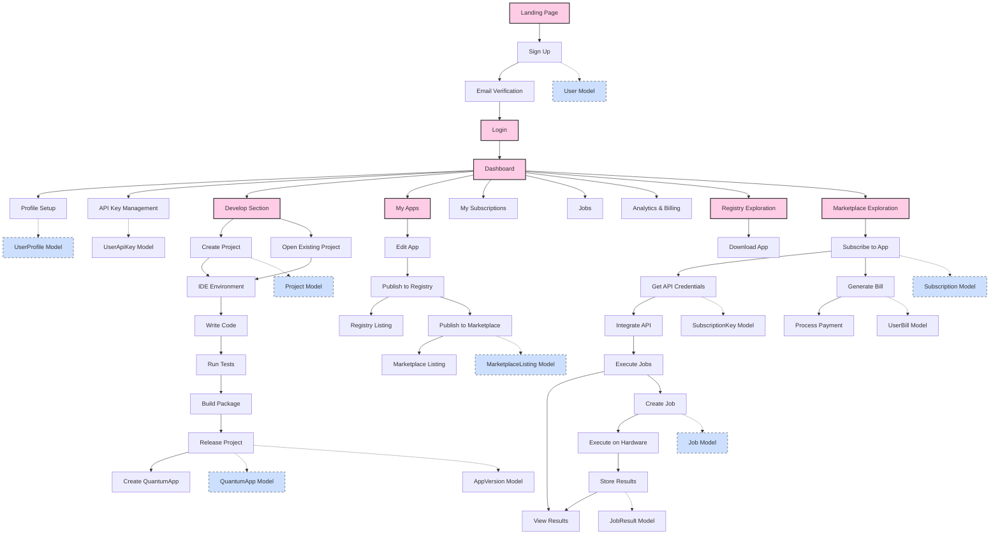

# Quantum Hub Backend Architecture

## Overview

The Quantum Hub backend serves as the core infrastructure for the Quantum Ecosystem, providing services for quantum application development, distribution, and execution. This document outlines the technical architecture, data models, API specifications, and service organization for the backend components.

## Technology Stack

- **Language**: Python 3.10+
- **Web Framework**: FastAPI
- **Database**: PostgreSQL 14+
- **ORM**: SQLAlchemy 2.0 with SQLModel
- **Authentication**: JWT with bcrypt password hashing
- **Storage**: PostgreSQL for development, AWS S3 for production
- **Container Orchestration**: Docker and Kubernetes
- **CI/CD**: GitHub Actions

## System Architecture

The Quantum Hub backend is designed as a microservices architecture, with each service responsible for a specific domain of functionality. The services communicate via REST APIs and share a common database.

### Services

1. **Auth Service**: User authentication, registration, and session management
2. **User Service**: User profile and preferences management
3. **Project Service**: Development project management and IDE integration
4. **App Service**: Quantum application management, versioning, and packaging
5. **Registry Service**: Distribution of open-source quantum applications
6. **Marketplace Service**: Commercial quantum application discovery and purchasing
7. **Execution Service**: Job submission, scheduling, and result handling
8. **Billing Service**: Subscription management and payment processing
9. **Analytics Service**: Usage tracking and reporting

### Cross-Cutting Concerns

- **Security**: JWT authentication, API key validation, role-based access control
- **Logging**: Structured logging with correlation IDs across services
- **Monitoring**: Prometheus metrics and Grafana dashboards
- **Tracing**: Distributed tracing with OpenTelemetry
- **Documentation**: Swagger/OpenAPI documentation for all APIs

## Data Models

### Core Entities

#### User & Authentication

```python
class User(Base, BaseModelMixin):
    __tablename__ = "users"

    username = Column(String(50), unique=True, nullable=False, index=True)
    email = Column(String(100), unique=True, nullable=False, index=True)
    hashed_password = Column(String(255), nullable=False)
    full_name = Column(String(100))
    roles = Column(ARRAY(String), nullable=False, default=["CONSUMER"])
    is_active = Column(Boolean, default=True)
    is_provider = Column(Boolean, default=False)
    last_login = Column(DateTime(timezone=True))

class UserProfile(Base, BaseModelMixin):
    __tablename__ = "user_profiles"

    user_id = Column(UUID(as_uuid=True), ForeignKey("users.id"), unique=True, nullable=False)
    organization = Column(String(100))
    bio = Column(Text)
    avatar_url = Column(String(255))
    contact_info = Column(JSONB)
    social_links = Column(JSONB)

class UserApiKey(Base, BaseModelMixin):
    __tablename__ = "user_api_keys"

    user_id = Column(UUID(as_uuid=True), ForeignKey("users.id"), nullable=False)
    name = Column(String(100), nullable=False)
    value = Column(String(255), unique=True, nullable=False, index=True)
    status = Column(Enum(ApiKeyStatus), default=ApiKeyStatus.ACTIVE, nullable=False)
    rate_limit = Column(String(50))
    expire_at = Column(DateTime(timezone=True))
    last_used_at = Column(DateTime(timezone=True))

class UserSession(Base, BaseModelMixin):
    __tablename__ = "user_sessions"

    user_id = Column(UUID(as_uuid=True), ForeignKey("users.id"), nullable=False)
    token = Column(String(255), unique=True, nullable=False)
    issued_at = Column(DateTime(timezone=True), nullable=False, default=datetime.utcnow)
    expires_at = Column(DateTime(timezone=True), nullable=False)
    ip_address = Column(String(50))
    user_agent = Column(String(255))
    is_active = Column(Boolean, default=True)
```

#### Development & Applications

```python
class Project(Base, BaseModelMixin):
    __tablename__ = "projects"

    name = Column(String(100), nullable=False)
    description = Column(Text)
    user_id = Column(UUID(as_uuid=True), ForeignKey("users.id"), nullable=False)
    quantum_app_id = Column(UUID(as_uuid=True), ForeignKey("quantum_apps.id"))
    repo = Column(String(255))

class QuantumApp(Base, BaseModelMixin):
    __tablename__ = "quantum_apps"

    developer_id = Column(UUID(as_uuid=True), ForeignKey("users.id"), nullable=False)
    name = Column(String(100), nullable=False)
    description = Column(Text)
    type = Column(Enum(AppType), nullable=False)
    status = Column(ARRAY(String), nullable=False, default=["DRAFT"])
    visibility = Column(Enum(AppVisibility), default=AppVisibility.PRIVATE, nullable=False)
    latest_version_id = Column(UUID(as_uuid=True), ForeignKey("app_versions.id"))
    api_url = Column(String(255))
    documentation_url = Column(String(255))
    license_type = Column(Enum(LicenseType), default=LicenseType.MIT)
    license_url = Column(String(255))
    readme_content = Column(Text)
    repository_url = Column(String(255))
    
    # Registry-specific fields
    is_in_registry = Column(Boolean, default=False)
    registry_published_at = Column(DateTime(timezone=True))
    featured_in_registry = Column(Boolean, default=False)
    registry_download_count = Column(Integer, default=0)

class AppVersion(Base, BaseModelMixin):
    __tablename__ = "app_versions"

    quantum_app_id = Column(UUID(as_uuid=True), ForeignKey("quantum_apps.id"), nullable=False)
    version_number = Column(String(20), nullable=False)  # e.g., '1.0.0'
    sdk_used = Column(Enum(SDKType), nullable=False)
    input_schema = Column(JSONB)
    output_schema = Column(JSONB)
    built_on_quantum_sdk_version = Column(String(50))
    preferred_platform = Column(String(50))
    preferred_device_id = Column(String(50))
    number_of_qubits = Column(Integer)
    average_execution_time = Column(String(50))
    source_repo = Column(String(255))
    source_commit_hash = Column(String(100))
    package_path = Column(String(255))
    package_data = Column(LargeBinary)  # For storing the actual package content
    ir_type = Column(String(50))
    ir_path = Column(String(255))
    resource_estimate = Column(JSONB)
    cost_estimate = Column(JSONB)
    benchmark_results = Column(JSONB)
    finetune_params = Column(JSONB)
    validation_results = Column(JSONB)
    security_scan_results = Column(JSONB)
    release_notes = Column(Text)
    is_latest = Column(Boolean, default=False)
    status = Column(Enum(VersionStatus), default=VersionStatus.DRAFT)
```

#### Marketplace & Monetization

```python
class MarketplaceListing(Base, BaseModelMixin):
    __tablename__ = "marketplace_listings"

    quantum_app_id = Column(UUID(as_uuid=True), ForeignKey("quantum_apps.id"), unique=True, nullable=False)
    listed_by = Column(UUID(as_uuid=True), ForeignKey("users.id"), nullable=False)
    price = Column(Numeric(precision=10, scale=2), nullable=False)
    currency = Column(String(3), default="USD", nullable=False)
    status = Column(Enum(MarketplaceListingStatus), default=MarketplaceListingStatus.ACTIVE)
    rating = Column(Float, default=0.0)
    rating_count = Column(Integer, default=0)
    preview_enabled = Column(Boolean, default=False)
    support_email = Column(String(100))
    support_url = Column(String(255))

class Subscription(Base, BaseModelMixin):
    __tablename__ = "subscriptions"

    user_id = Column(UUID(as_uuid=True), ForeignKey("users.id"), nullable=False)
    quantum_app_id = Column(UUID(as_uuid=True), ForeignKey("quantum_apps.id"), nullable=False)
    subscription_type = Column(Enum(SubscriptionType), nullable=False)
    start_date = Column(DateTime(timezone=True), nullable=False)
    end_date = Column(DateTime(timezone=True))
    status = Column(Enum(SubscriptionStatus), default=SubscriptionStatus.ACTIVE)
    service_uri = Column(String(255))
    rate = Column(Numeric(precision=10, scale=2))

class SubscriptionKey(Base, BaseModelMixin):
    __tablename__ = "subscription_keys"

    subscription_id = Column(UUID(as_uuid=True), ForeignKey("subscriptions.id"), nullable=False)
    name = Column(String(100), nullable=False)
    value = Column(String(255), unique=True, nullable=False)
    type = Column(Enum(SubscriptionType), nullable=False)
    remaining_usage_count = Column(Integer)
    rate_limit = Column(String(50))
    status = Column(Enum(ApiKeyStatus), default=ApiKeyStatus.ACTIVE)
    expire_at = Column(DateTime(timezone=True))
```

#### Execution & Hardware

```python
class Hardware(Base, BaseModelMixin):
    __tablename__ = "hardware"

    name = Column(String(100), nullable=False)
    provider = Column(String(100), nullable=False)
    technology_type = Column(Enum(HardwareTechnology), nullable=False)
    platform = Column(Enum(HardwarePlatform), nullable=False)
    description = Column(Text)
    status = Column(Enum(HardwareStatus), default=HardwareStatus.OFFLINE)
    qubits = Column(Integer)
    connectivity_map = Column(JSONB)
    gate_set = Column(ARRAY(String))
    average_queue_time = Column(Integer)  # in minutes
    cost_per_hour = Column(Numeric(precision=10, scale=2))
    documentation_url = Column(String(255))

class Job(Base, BaseModelMixin):
    __tablename__ = "jobs"

    subscription_id = Column(UUID(as_uuid=True), ForeignKey("subscriptions.id"), nullable=False)
    platform = Column(String(50), nullable=False)
    device_id = Column(String(50))
    run_mode = Column(Enum(JobRunMode), default=JobRunMode.BLOCKING)
    scaling_config = Column(JSONB)
    platform_job_id = Column(String(100))
    status = Column(Enum(JobStatus), default=JobStatus.PROVISIONING)
    results_storage_path = Column(String(255))
    notification_email = Column(String(100))
    tags = Column(ARRAY(String))
    estimated_cost = Column(Numeric(precision=10, scale=2))
    actual_cost = Column(Numeric(precision=10, scale=2))

class JobResult(Base, BaseModelMixin):
    __tablename__ = "job_results"

    job_id = Column(UUID(as_uuid=True), ForeignKey("jobs.id"), unique=True, nullable=False)
    error = Column(Text)
    counts = Column(JSONB)
    status = Column(String(50))
    execution_time = Column(Float)  # in seconds
    result_data = Column(JSONB)
```

#### Billing & Analytics

```python
class UserBill(Base, BaseModelMixin):
    __tablename__ = "user_bills"

    user_id = Column(UUID(as_uuid=True), ForeignKey("users.id"), nullable=False)
    paid_amount = Column(Numeric(precision=10, scale=2), default=0)
    pending_amount = Column(Numeric(precision=10, scale=2), default=0)
    billing_date = Column(DateTime(timezone=True), nullable=False)
    due_date = Column(DateTime(timezone=True))
    payment_status = Column(String(50))
    invoice_url = Column(String(255))

class BillingItem(Base, BaseModelMixin):
    __tablename__ = "billing_items"
    
    bill_id = Column(UUID(as_uuid=True), ForeignKey("user_bills.id"), nullable=False)
    description = Column(String(255), nullable=False)
    amount = Column(Numeric(precision=10, scale=2), nullable=False)
    quantity = Column(Integer, default=1)
    subscription_id = Column(UUID(as_uuid=True), ForeignKey("subscriptions.id"))
```

### Supplementary Entities

```python
class AppMetrics(Base, BaseModelMixin):
    __tablename__ = "app_metrics"

    quantum_app_id = Column(UUID(as_uuid=True), ForeignKey("quantum_apps.id"), unique=True, nullable=False)
    views = Column(Integer, default=0)
    downloads = Column(Integer, default=0)
    registry_likes = Column(Integer, default=0)
    marketplace_likes = Column(Integer, default=0)
    number_of_subscriptions = Column(Integer, default=0)
    average_rating = Column(Float, default=0.0)

class Tag(Base, BaseModelMixin):
    __tablename__ = "tags"
    
    name = Column(String(50), unique=True, nullable=False)
    category = Column(String(50))

class Review(Base, BaseModelMixin):
    __tablename__ = "reviews"

    quantum_app_id = Column(UUID(as_uuid=True), ForeignKey("quantum_apps.id"), nullable=False)
    user_id = Column(UUID(as_uuid=True), ForeignKey("users.id"), nullable=False)
    rating = Column(Integer, nullable=False)  # 1-5 stars
    title = Column(String(100))
    content = Column(Text)

class Notification(Base, BaseModelMixin):
    __tablename__ = "notifications"

    user_id = Column(UUID(as_uuid=True), ForeignKey("users.id"), nullable=False)
    title = Column(String(100), nullable=False)
    message = Column(Text, nullable=False)
    type = Column(Enum(NotificationType), default=NotificationType.INFO)
    read = Column(Boolean, default=False)

class Documentation(Base, BaseModelMixin):
    __tablename__ = "documentation"

    quantum_app_id = Column(UUID(as_uuid=True), ForeignKey("quantum_apps.id"), nullable=False)
    title = Column(String(100), nullable=False)
    content = Column(Text, nullable=False)
    order = Column(Integer, default=0)

class UsageAnalytics(Base, BaseModelMixin):
    __tablename__ = "usage_analytics"

    user_id = Column(UUID(as_uuid=True), ForeignKey("users.id"), nullable=False)
    quantum_app_id = Column(UUID(as_uuid=True), ForeignKey("quantum_apps.id"), nullable=False)
    endpoint = Column(String(255))
    request_count = Column(Integer, default=0)
    compute_time_seconds = Column(Float, default=0.0)
    date = Column(Date, nullable=False)
```

## API Structure

### Authentication Service
- `POST /auth/register` - User registration
- `POST /auth/login` - User login
- `POST /auth/refresh` - Refresh token
- `POST /auth/logout` - Logout
- `GET /auth/me` - Get current user info
- `POST /auth/reset-password` - Request password reset
- `POST /auth/reset-password/{token}` - Complete password reset
- `GET /auth/verify/{token}` - Verify email address

### User Management
- `GET /users` - List users (admin only)
- `GET /users/{id}` - Get user details
- `PUT /users/{id}` - Update user
- `DELETE /users/{id}` - Delete user
- `GET /users/{id}/profile` - Get user profile
- `PUT /users/{id}/profile` - Update user profile

### API Key Management
- `GET /api-keys` - List user's API keys
- `POST /api-keys` - Create new API key
- `GET /api-keys/{id}` - Get API key details
- `PUT /api-keys/{id}` - Update API key
- `DELETE /api-keys/{id}` - Delete/revoke API key

### Project Management
- `GET /projects` - List user's projects
- `POST /projects` - Create new project
- `GET /projects/{id}` - Get project details
- `PUT /projects/{id}` - Update project
- `DELETE /projects/{id}` - Delete project
- `POST /projects/{id}/release` - Release project as app (creates QuantumApp)

### Quantum App Management
- `GET /quantum-apps` - List quantum apps (with filters)
- `POST /quantum-apps` - Create quantum app
- `GET /quantum-apps/{id}` - Get quantum app details
- `PUT /quantum-apps/{id}` - Update quantum app
- `DELETE /quantum-apps/{id}` - Delete quantum app
- `POST /quantum-apps/{id}/publish-registry` - Publish to registry
- `POST /quantum-apps/{id}/publish-marketplace` - Publish to marketplace
- `GET /quantum-apps/{id}/metrics` - Get app metrics

### App Version Management
- `GET /quantum-apps/{app_id}/versions` - List versions
- `POST /quantum-apps/{app_id}/versions` - Create new version
- `GET /quantum-apps/{app_id}/versions/{id}` - Get version details
- `PUT /quantum-apps/{app_id}/versions/{id}` - Update version
- `DELETE /quantum-apps/{app_id}/versions/{id}` - Delete version
- `GET /quantum-apps/{app_id}/versions/{id}/download` - Download package

### Registry API
- `GET /registry` - List registry entries
- `GET /registry/{id}` - Get registry entry details
- `POST /registry/download/{id}` - Download registry app

### Marketplace API
- `GET /marketplace` - List marketplace entries
- `GET /marketplace/{id}` - Get marketplace entry details
- `POST /marketplace/{id}/trial` - Get trial subscription
- `POST /marketplace/{id}/subscribe` - Create paid subscription

### Subscription Management
- `GET /subscriptions` - List user's subscriptions
- `GET /subscriptions/{id}` - Get subscription details
- `PUT /subscriptions/{id}` - Update subscription
- `DELETE /subscriptions/{id}` - Cancel subscription
- `GET /subscriptions/{id}/keys` - List subscription keys
- `POST /subscriptions/{id}/keys` - Create new subscription key

### Job Management
- `POST /jobs` - Create and submit new job
- `GET /jobs` - List user's jobs
- `GET /jobs/{id}` - Get job details
- `DELETE /jobs/{id}` - Cancel job
- `GET /jobs/{id}/result` - Get job result

### Hardware API
- `GET /hardware` - List available quantum hardware
- `GET /hardware/{id}` - Get hardware details

### Billing API
- `GET /bills` - List user's bills
- `GET /bills/{id}` - Get bill details
- `GET /bills/{id}/download` - Download invoice

## Authentication Flow

1. **Registration**:
   - User submits registration form with email, password
   - Backend validates input, checks for existing users
   - Backend creates new User record with hashed password
   - Backend sends email verification token
   - User clicks verification link
   - Backend verifies token and activates account

2. **Login**:
   - User submits credentials
   - Backend validates credentials
   - Backend generates JWT token
   - Backend creates UserSession record
   - Backend returns token to client

3. **Authentication**:
   - Client includes JWT in Authorization header
   - Backend validates token signature and expiration
   - Backend attaches user to request context
   - Backend checks user permissions for requested resource

4. **API Key Authentication**:
   - Client includes API key in X-API-Key header
   - Backend validates key existence and expiration
   - Backend checks rate limits and permissions
   - Backend logs usage for billing purposes

## User Workflows

### Developer Workflow

1. **Project Creation and Development**:
   - User creates project in Develop section
   - User writes quantum code in embedded IDE
   - User tests code with simulations
   - User builds package for release

2. **App Publishing**:
   - User releases project as quantum app
   - User publishes app to Registry for open-source distribution
   - User publishes app to Marketplace for monetization
   - User tracks analytics and usage

### Consumer Workflow

1. **Discovery and Acquisition**:
   - User browses Registry or Marketplace
   - User downloads app from Registry or subscribes in Marketplace
   - User obtains API credentials

2. **Consumption**:
   - User integrates API credentials in their application
   - User submits jobs for execution
   - User retrieves results
   - User manages subscriptions and billing

## Implementation Plan

### Phase 1: Core Infrastructure
- Database setup and migrations
- Authentication service
- User management service
- Basic project management

### Phase 2: Development Environment
- Project service with GitHub integration
- App packaging and versioning
- Registry implementation

### Phase 3: Marketplace & Monetization
- Marketplace listings
- Subscription management
- Billing system

### Phase 4: Execution Engine
- Hardware integration
- Job scheduling
- Result management

### Phase 5: Analytics & Monitoring
- Usage tracking
- Performance metrics
- Admin dashboard

## Technical Requirements

- **Performance**: API endpoints should respond within 500ms for 95% of requests
- **Scalability**: System should handle 1000+ concurrent users
- **Availability**: 99.9% uptime for core services
- **Security**: Data encryption at rest and in transit, regular security audits
- **Testing**: 80%+ code coverage with unit and integration tests
- **Documentation**: Complete API documentation with examples

## Deployment Strategy

- **Development**: Local Docker containers
- **Staging**: Kubernetes cluster with CI/CD pipeline
- **Production**: Managed Kubernetes with auto-scaling

## Monitoring & Observability

- **Logging**: Structured logs with ELK stack
- **Metrics**: Prometheus for system metrics
- **Tracing**: OpenTelemetry for distributed tracing
- **Alerts**: Automated alerts for system anomalies


### Quantum Hub Detailed Flow Analysis

## 1. User Authentication & Onboarding

### Initial Access
- User navigates to the Quantum Hub landing page
- User views marketing content explaining the platform's capabilities
- User clicks "Sign Up" button in the navigation bar
- System displays registration form with fields for username, email, password, and optional full name
- User completes form and submits
- Frontend validates inputs (email format, password strength)
- Frontend sends POST request to `/auth/register` endpoint
- Backend validates inputs again
- Backend creates new User record with both DEVELOPER and CONSUMER roles
- Backend generates confirmation token and sends verification email
- System displays "Verification email sent" message
- User receives email and clicks verification link
- Backend validates token, sets `is_active=true` for the user
- System redirects to login page with success message

### Authentication
- User enters credentials on login page
- Frontend sends POST request to `/auth/login` endpoint
- Backend validates credentials against `User.hashed_password`
- Backend creates UserSession record with JWT token
- Backend returns JWT token and user information
- Frontend stores token in local storage/cookies
- System redirects to Dashboard
- If first login, system displays onboarding tutorial

## 2. Profile & API Key Setup

### Profile Completion
- User navigates to Settings from Dashboard
- User views profile form with fields for organization, bio, avatar
- User completes profile information
- Frontend sends PUT request to `/users/{id}/profile` endpoint
- Backend creates or updates UserProfile record
- System displays success message

### API Key Generation
- User navigates to "API Keys" section in Dashboard
- System displays list of existing API keys (if any)
- User clicks "Generate New API Key" button
- System displays form for key name and optional expiration
- User completes form and submits
- Frontend sends POST request to `/api-keys` endpoint
- Backend generates secure random string for key value
- Backend creates UserApiKey record
- Backend returns full key value (only shown once)
- System displays key with copy button and warning that it won't be shown again
- Subsequent views show masked key value (e.g., "sk_****1234")

## 3. Project Development Workflow

### Project Creation
- User navigates to "Develop" section in main navigation
- System displays list of existing projects (if any)
- User clicks "Create New Project" button
- System displays project creation form with fields for name, description, type, template
- User completes form and submits
- Frontend sends POST request to `/projects` endpoint
- Backend creates Project record
- System redirects to project detail page

### Development Environment
- User views project details with "Open IDE" button
- User clicks "Open IDE" button
- System loads embedded VSCode IDE with project scaffolding
- Scaffolding includes:
  - `src/` directory for quantum code
  - `tests/` directory for unit tests
  - `dist/` directory for build artifacts
  - Configuration files (`requirements.txt`, `manifest.json`)
- User writes quantum circuit/algorithm using chosen SDK
- User runs local tests within IDE
- User triggers e2e-pipeline via GitHub Actions integration
- Pipeline runs tests, validation, and builds package
- Package (zip) is generated in `dist/` folder

### Project Release
- User clicks "Release Project" button in IDE or project page
- System displays multi-step wizard:
  - Step 1: Basic Information (name, description, type)
  - Step 2: Version details (version number, SDK used, platforms)
  - Step 3: Upload package (or use auto-generated package)
  - Step 4: Review information
- User completes wizard and submits
- Frontend sends POST request to `/projects/{id}/release` endpoint with form data and package
- Backend creates QuantumApp record with `status=["PACKAGED", "UPLOADED"]`
- Backend creates AppVersion record with technical metadata
- Backend stores package in database (temporarily, later S3)
- System redirects to app detail page with success message

## 4. Quantum App Management

### App Dashboard
- User navigates to "Dashboard" in main navigation
- User clicks "My Apps" tab
- System displays list of user's quantum apps with status indicators
- User can filter by status, type, or search by name
- User clicks on app to view details

### App Editing
- User views app details page
- User clicks "Edit" button
- System displays app edit form with current values
- User updates information and submits
- Frontend sends PUT request to `/quantum-apps/{id}` endpoint
- Backend updates QuantumApp record
- System displays success message

### Publishing to Registry
- User views app details page
- User clicks "Publish to Registry" button
- System displays confirmation dialog with registry guidelines
- User confirms publication
- Frontend sends POST request to `/quantum-apps/{id}/publish-registry` endpoint
- Backend updates `QuantumApp.status` to include "PUBLISHED_REGISTRY"
- Backend sets `is_in_registry=true` and `registry_published_at` timestamp
- System displays success message with link to registry listing

### Publishing to Marketplace
- User views app details page for registry-published app
- User clicks "Publish to Marketplace" button
- System displays multi-step marketplace wizard:
  - Step 1: API Details (endpoints, input/output schema)
  - Step 2: Pricing information (subscription tiers)
  - Step 3: Support details (email, documentation)
  - Step 4: Review and publish
- User completes wizard and submits
- Frontend sends POST request to `/quantum-apps/{id}/publish-marketplace` endpoint
- Backend updates `QuantumApp.status` to include "PUBLISHED_MARKETPLACE"
- Backend creates MarketplaceListing record
- System displays success message with link to marketplace listing

## 5. Registry & Marketplace Exploration

### Registry Browsing
- User navigates to "Registry" in main navigation
- System displays grid of registry apps with filtering options
- Backend queries apps where `is_in_registry=true`
- User applies filters (type, SDK, platform) or searches
- User clicks on app to view details
- System displays app details page with readme, versions, metrics
- User clicks "Download" button for preferred version
- Frontend sends POST request to `/registry/download/{id}` endpoint
- Backend increments `registry_download_count`
- Backend returns package file for download
- User receives zip package with quantum app files

### Marketplace Browsing
- User navigates to "Marketplace" in main navigation
- System displays grid of marketplace apps with filtering options
- Backend queries apps with associated MarketplaceListing records
- User applies filters (price, type, rating) or searches
- User clicks on app to view details
- System displays marketplace listing with pricing, rating, documentation

### Subscription Process
- User views marketplace listing
- User clicks "Get Trial" or "Subscribe" button
- System displays subscription confirmation with terms and pricing
- User confirms subscription
- Frontend sends POST request to `/marketplace/{id}/subscribe` endpoint
- Backend creates Subscription record with appropriate `subscription_type`
- Backend creates SubscriptionKey for API access
- If paid tier, backend creates/updates UserBill record
- System redirects to "My Subscriptions" page
- User views subscription details and API access credentials

## 6. Quantum Execution Workflow

### API Integration
- User navigates to "API Keys" or "My Subscriptions" in Dashboard
- User copies subscription key for desired API
- User integrates key into their application code
- User's application makes API calls to quantum service endpoint

### Job Execution
- User's application sends request with subscription key
- Backend validates SubscriptionKey status and limits
- Backend creates Job record with `status="QUEUED"`
- If blocking mode:
  - Backend holds connection open
  - Job executes on selected hardware
  - Backend updates `Job.status` to "RUNNING" then "COMPLETED"
  - Backend creates JobResult record
  - Backend returns results to user's application
- If non-blocking mode:
  - Backend returns job ID immediately
  - Job executes asynchronously
  - User's application polls `/jobs/{id}` endpoint
  - When complete, backend returns results

## 7. Analytics & Billing
### Usage Analytics
- User navigates to "Analytics" section in Dashboard
- System displays charts for API requests, compute time, costs
- User can filter by date range, app, or subscription
- System shows trends and usage patterns

### Billing Management
- User navigates to "Billing" section in Dashboard
- System displays current billing period, pending charges, payment history
- User can view itemized charges for each subscription
- User can download invoice PDFs
- User can update payment methods or billing preferences


